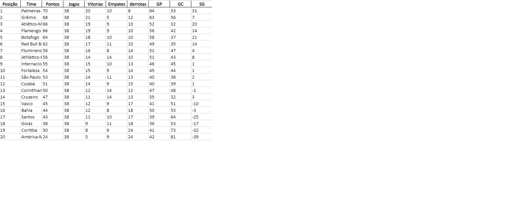
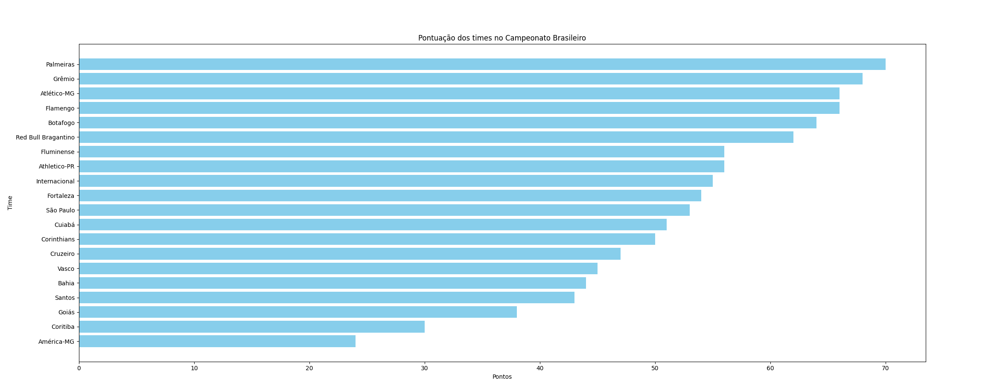

<h1 align="center"> Bar-Table 📊 </h1>

  <a href="#-Technologies">Technologies</a>&nbsp;&nbsp;&nbsp;|&nbsp;&nbsp;&nbsp;
  <a href="#-Project">Project</a>&nbsp;&nbsp;&nbsp;|&nbsp;&nbsp;&nbsp;
  <a href="#-Learning">-Learning</a>&nbsp;&nbsp;&nbsp;|&nbsp;&nbsp;&nbsp;

 

## 🔍 Technologies

This project was developed with the following technologies:

Python

## 🎓 Learning

This project was created in order to study a little more about the panda, matplotlib and scrapy libraries where scrapy was used to scrape data from a website and pandas to read and compress the information and transform it into a table in excell and using matplotlib to generate a table in bar graphs

## 💻 Project

This project aims to provide you with the table of the Brasileirão in two presentable forms, both in the form of a bar graph and in the form of an excel table

---
#
